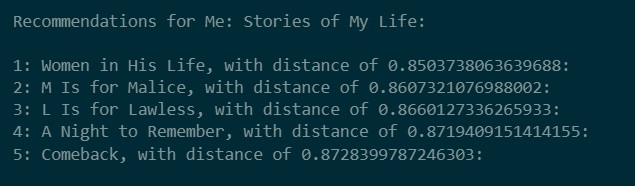

## <b> PROJECT  : Book Recommendation System using Collaborative Filtering
        
## <b> RESULTS : 

### <b> Description: 
* This is a Jupyter notebook file containing Python code for a book recommendation system. 
* It first imports necessary libraries and reads in three datasets: BX-Books.csv, BX-Users.csv, and BX-Book-Ratings.csv.
* The code creates a recommendation system based on rating count and another based on correlation using Pearson's R correlation coefficient. 
* The system based on correlation is built using collaborative filtering with the K-Nearest Neighbors algorithm.

### Libraries Used: 
        - sklearn
        - scipy
        - numpy
        - pandas
        - matplotlib
        
