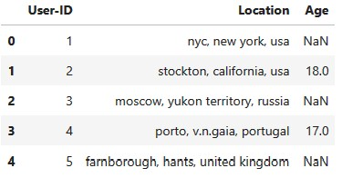
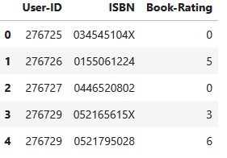

# <b> PROJECT  : Book Recommendation System using Collaborative Filtering.
________________________________________________________
        
## Objective: 
>* The objective of this project is to build a book recommendation system that uses various methods such as recommendation based on rating count, correlation, and collaborative filtering to provide personalized book recommendations to users based on their preferences and reading history.
        
        
## <b> Peoject walkthrough: 
>* Data Exploration: The code loads and explores the book, user, and rating datasets to understand their structure and contents.

>* Recommendation based on Rating Count: The code groups book ratings by ISBN and rating count, and identifies the books with the highest rating count to generate recommendations.

>* Recommendation based on Correlation: The code calculates the Pearson correlation coefficient between the ratings of different books to find those that are most similar to a given book.

>* Collaborative Filtering: The code implements the K-Nearest Neighbors (KNN) algorithm to cluster users with similar book preferences and generate predictions based on the average rating of their nearest neighbors.

>* Evaluation: The code evaluates the performance of the recommendation system using the Mean Absolute Error (MAE) metric, and suggests ways to improve the system.
____________________________________________
        
# Libraries Used: 
        - sklearn
        - scipy
        - numpy
        - pandas
        - matplotlib

_______________________________________
# <b> RESULTS : 

# <b> 
DATASETS USED  : 
1. BX-Books.csv

________________
2. BX-Users.csv

________________________
3. BX-Book-Ratings.csv

# <b> License
This project is licensed under the MIT License.
