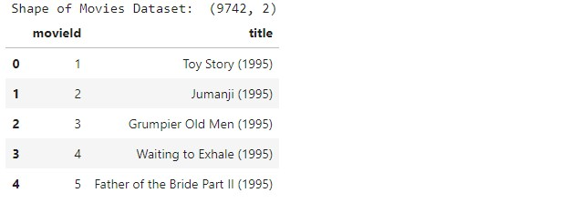
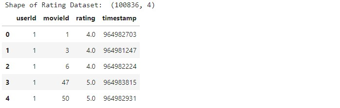
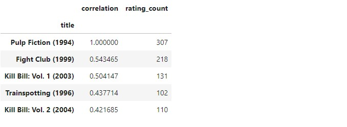

# <b> PROJECT : Finding Your Next Favorite Movie with a Recommendation System.
____________________
  
## Objective: 
> The objective of this project is to build a movie recommendation system that can suggest similar movies to users based on their rating history, providing a personalized and enjoyable movie-watching experience.

## Project Walkthrough:
>* The project begins with importing necessary libraries and loading the dataset from CSV files into pandas dataframes.
>* Exploratory data analysis is then performed using visualizations to understand the data better and identify patterns and insights.
>* A matrix table is created with userId on one axis and movie title on the other axis, and each cell contains the rating that the user gave to that movie.
>* Using the correlation between two pandas series, similar movies to a given movie are identified, and a recommendation system is built based on the correlation score and rating count.
>* Finally, the recommendations are displayed, and the user can choose to watch the recommended movies based on their personal preferences.

## Library Used: 
>* pandas: for data manipulation and analysis
>* numpy: for mathematical operations
>* matplotlib: for data visualization
>* seaborn: for statistical data visualization
  
## DATASETS : 
  Datasets van be found in the 'Datasets' Folder.
  Here's how they look like:
  
  1) Movie Dataframe:
  
  
_____________
  2) Ratings Dataframe:
  
  
____________________

  
## RESULTS: 
>* A recommendation system that suggests similar movies based on user ratings.
>* A correlation table that shows the correlation between two movies based on user ratings.
>* A sorted list of recommended movies based on correlation and rating count.
>* Insights into popular and highly rated movies based on the dataset.
>* A dataset that has been cleaned and merged for further analysis.

  
  
# License
This project is licensed under the MIT License.
